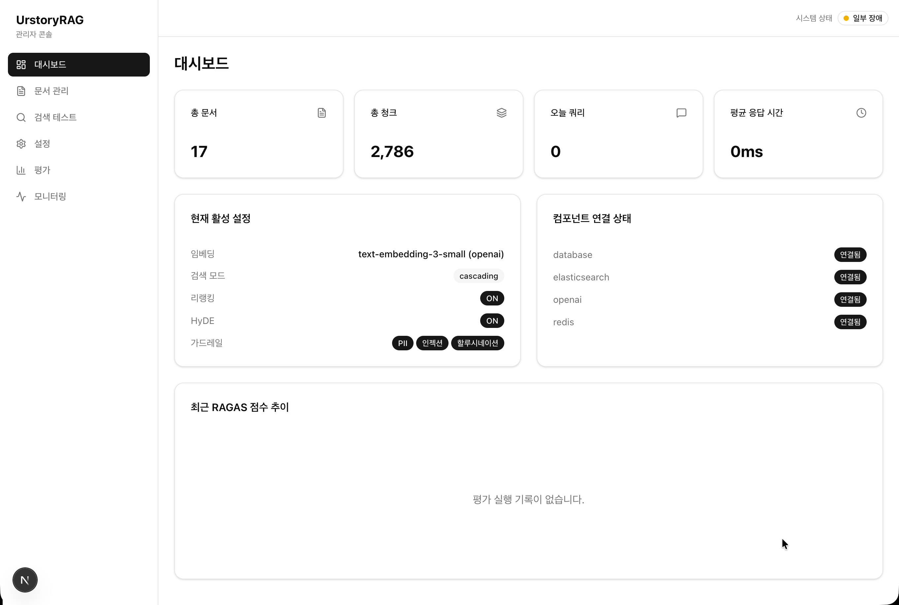
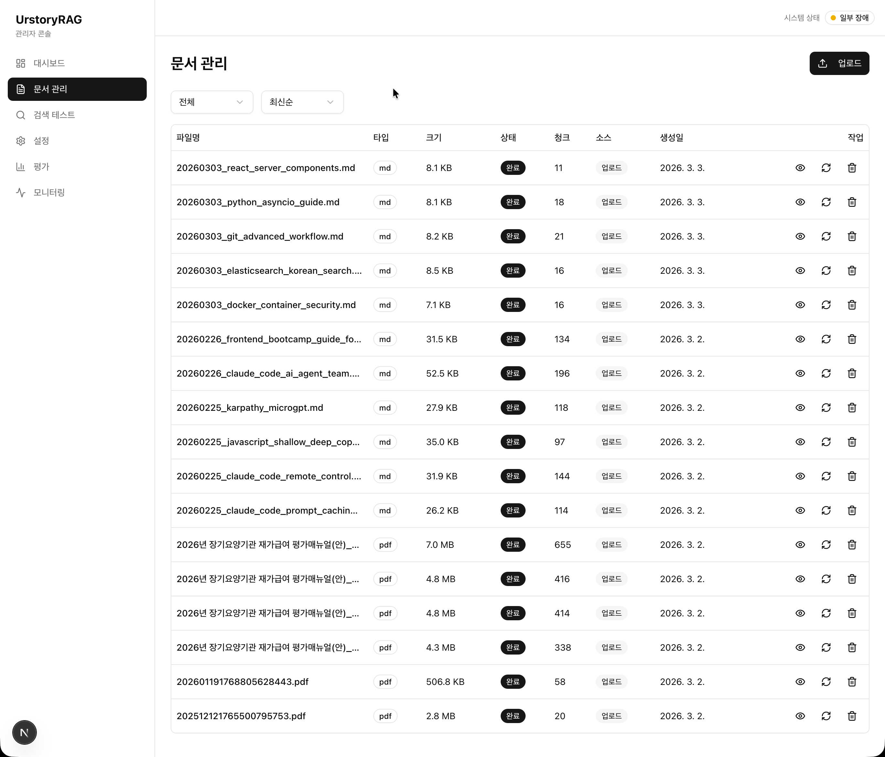
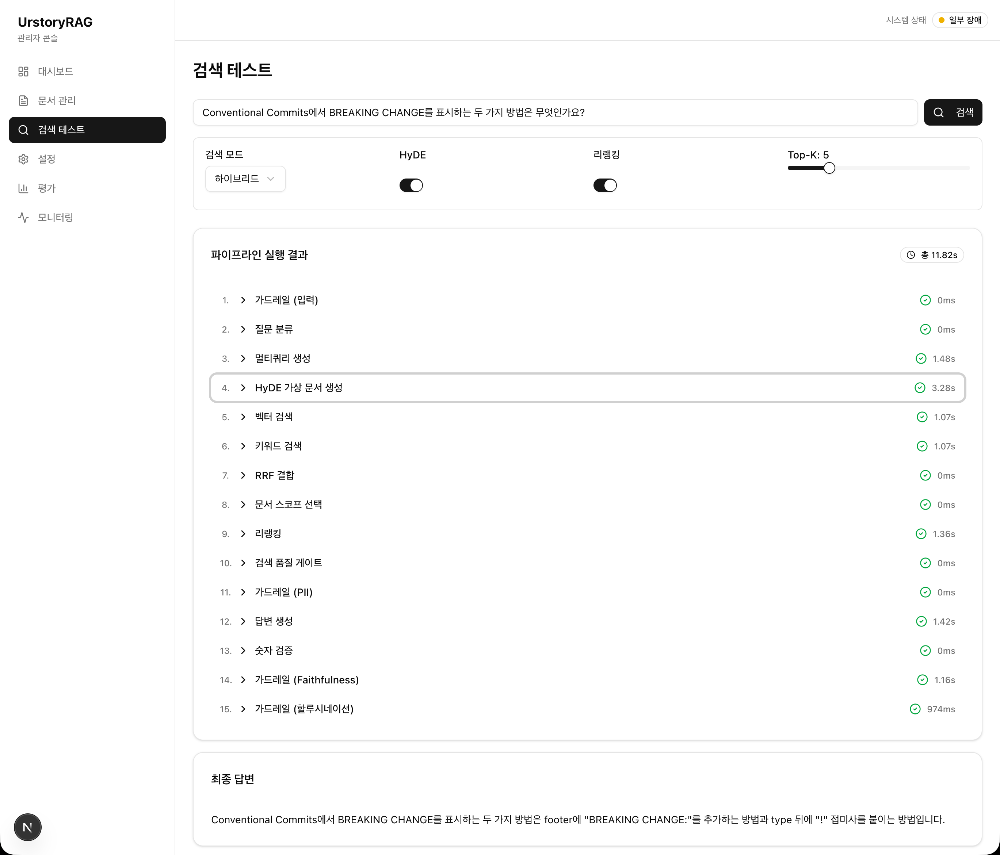
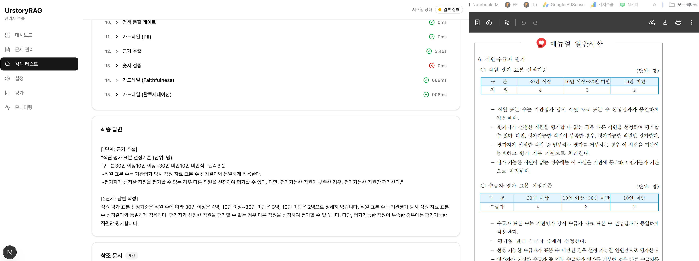
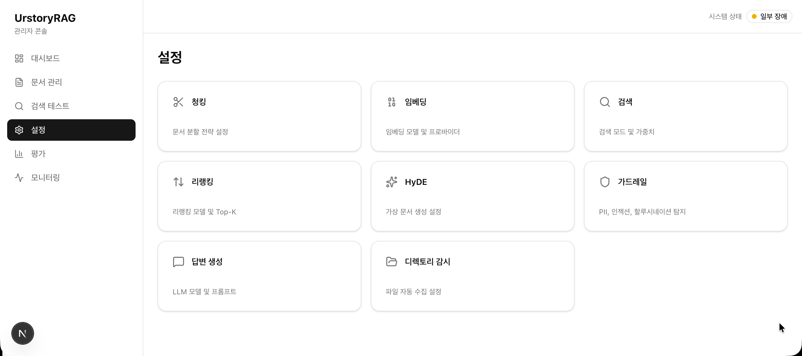
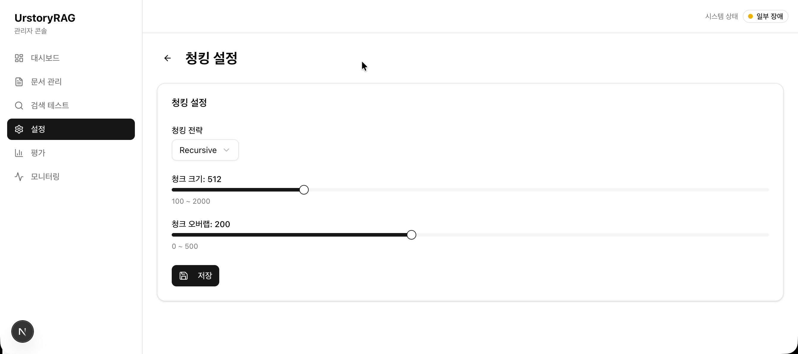

# 프론트엔드 아키텍처

## 기술 스택

| 항목 | 기술 | 버전 | 용도 |
|------|------|------|------|
| 프레임워크 | Next.js (App Router) | 16.x | SSR, 라우팅, API 프록시 |
| UI 라이브러리 | React | 19.x | 컴포넌트 기반 UI |
| 스타일링 | Tailwind CSS | 4.x | 유틸리티 기반 스타일링 |
| UI 컴포넌트 | shadcn/ui + Radix UI | - | 재사용 가능한 컴포넌트 |
| 상태 관리 | TanStack Query | v5 | 서버 상태 관리, 캐싱 |
| 폼 관리 | React Hook Form + Zod | - | 폼 검증 |
| 아이콘 | Lucide React | - | 아이콘 |
| 차트 | Recharts | 3.x | 모니터링 차트 |
| 토스트 | Sonner | - | 알림 메시지 |
| 패키지 매니저 | pnpm | 10.x | 의존성 관리 |

**포트 설정:**
- 개발 서버: `3500` (`next dev -p 3500`)
- 프로덕션: `3000` (`next start`)

**API 프록시 (Next.js Rewrites):**

`API_BASE = ""`로 설정하고, Next.js의 rewrites 기능으로 `/api/*` 요청을 백엔드(`http://localhost:8000/api/*`)로 프록시한다. 이 방식으로 CORS 설정 없이 프론트엔드와 백엔드를 연동한다.

```typescript
// next.config.ts
const nextConfig: NextConfig = {
  output: "standalone",
  async rewrites() {
    return [
      {
        source: "/api/:path*",
        destination: `${process.env.NEXT_PUBLIC_API_URL || "http://localhost:8000"}/api/:path*`,
      },
    ];
  },
};
```

## 페이지 구조

```
/                          → 대시보드 (시스템 상태, 주요 지표, RAGAS 차트)
/documents                 → 문서 관리 (목록 + 업로드 다이얼로그)
  /documents/[id]          → 문서 상세 (청크 목록, 메타데이터)
/search                    → 검색 테스트 (쿼리 입력, 파이프라인 트레이스, 결과 확인)
/settings                  → 설정 허브 (8개 카드 그리드)
  /settings/chunking       → 청킹 설정
  /settings/embedding      → 임베딩 모델 설정
  /settings/search         → 검색 엔진 설정
  /settings/reranking      → 리랭킹 설정
  /settings/hyde           → HyDE 설정
  /settings/guardrails     → 가드레일 설정
  /settings/generation     → 답변 생성 설정
  /settings/watcher        → 디렉토리 감시 설정
/evaluation                → RAGAS 평가
  /evaluation/datasets     → 평가 데이터셋 관리
  /evaluation/runs         → 평가 실행 기록
  /evaluation/compare      → 설정별 비교
/monitoring                → 모니터링
  /monitoring/traces       → Langfuse 트레이스 뷰
  /monitoring/metrics      → 시스템 메트릭
```

> **참고:** `/documents/upload`는 별도 라우트가 아니다. 업로드 기능은 `/documents` 페이지의 Dialog 컴포넌트(`DocumentUpload`)로 구현되어 있으며, 헤더 영역의 "업로드" 버튼을 클릭하면 다이얼로그가 열린다.

## 대시보드 구성

대시보드(`/`)는 시스템의 전체 상태를 한눈에 파악할 수 있는 페이지이다.



### 구성 요소

**통계 카드 (4열 그리드):**
- 총 문서 수
- 총 청크 수
- 오늘 쿼리 수
- 평균 응답 시간 (ms)

**현재 활성 설정 카드:**
- 임베딩: `text-embedding-3-small (openai)`
- 검색 모드: `hybrid` | `vector` | `keyword` | `cascading`
- 리랭킹: ON/OFF (bge-reranker-v2-m3-ko)
- HyDE: ON/OFF (`gpt-4.1-mini`)
- 가드레일: PII / 인젝션 / 할루시네이션 각각 ON/OFF 배지 표시

**컴포넌트 연결 상태 카드:**
- `database`, `elasticsearch`, `openai`, `redis` 등 각 컴포넌트의 연결 상태를 "연결됨" / "미연결" 배지로 표시

**최근 RAGAS 점수 추이 차트:**
- Recharts BarChart를 사용하여 최근 5회 평가 결과의 Faithfulness, Relevancy, Precision, Recall 점수를 시각화

## 문서 관리

문서 관리 페이지(`/documents`)는 업로드된 문서와 감시 디렉토리에서 수집된 문서를 테이블 형태로 보여준다.



### 기능

- **문서 목록 테이블:** 파일명, 타입, 크기, 상태(대기/처리 중/완료/실패), 청크 수, 소스(업로드/감시), 생성일 표시
- **필터:** 소스 필터(전체/업로드/감시), 정렬 순서(최신순/오래된순) 선택
- **페이지네이션:** 총 문서 수 및 페이지 이동 지원
- **문서 작업:** 상세 보기(Eye), 재인덱싱(RefreshCw), 삭제(Trash2) 버튼
- **업로드 다이얼로그:** "업로드" 버튼 클릭 시 Dialog 팝업 오픈, 드래그 앤 드롭 및 파일 선택 지원 (PDF, DOCX, TXT, MD)
- **삭제 확인:** 삭제 시 Dialog로 확인 절차 진행

## 검색 테스트 페이지

관리자가 쿼리를 입력하고 전체 RAG 파이프라인의 실행 결과를 단계별로 확인할 수 있다.



### 검색 옵션

- **검색 모드:** hybrid (하이브리드) | vector (벡터) | keyword (키워드) | cascading (캐스캐이딩, Phase 10에서 추가)
- **HyDE:** ON/OFF 토글
- **리랭킹:** ON/OFF 토글
- **Top-K:** 1~20 슬라이더

### 파이프라인 15단계

검색 실행 시 파이프라인 트레이스가 최대 15단계로 표시된다. 각 단계는 통과/실패 상태, 소요 시간, 상세 정보를 표시하며 클릭하면 펼쳐져 세부 정보를 확인할 수 있다.

| 단계 | 이름 | 설명 |
|------|------|------|
| 1 | 가드레일 (입력) | 프롬프트 인젝션 검사 |
| 2 | 질문 분류 | 질문 유형 분류 |
| 3 | 멀티쿼리 생성 | 쿼리 변형 생성 |
| 4 | HyDE 가상 문서 생성 | 가상 문서를 생성하여 임베딩 품질 향상 |
| 5 | 벡터 검색 | PGVector 기반 시맨틱 검색 |
| 6 | 키워드 검색 | Elasticsearch+Nori 기반 키워드 검색 |
| 7 | RRF 결합 | Reciprocal Rank Fusion으로 결과 병합 |
| 8 | 문서 스코프 선택 | 검색 범위 필터링 |
| 9 | 리랭킹 | bge-reranker-v2-m3-ko로 재정렬 |
| 10 | 검색 품질 게이트 | 최소 품질 기준 미달 시 차단 |
| 11 | 가드레일 (PII) | 개인정보 탐지 |
| 12 | 근거 추출 / 답변 생성 | 컨텍스트 기반 답변 생성 |
| 13 | 숫자 검증 | 답변 내 숫자의 정확성 검증 |
| 14 | 가드레일 (Faithfulness) | 답변의 근거 충실도 검증 |
| 15 | 가드레일 (할루시네이션) | 할루시네이션 탐지 |

> **참고:** cascading 모드에서는 BM25 품질 평가, 쿼리 확장, 확장 키워드 재검색, 확장 결과 품질 평가, 벡터 폴백(RRF) 등 추가 단계가 파이프라인에 삽입된다.

### 검색 결과 표시



검색 결과는 두 영역으로 구성된다:

- **최종 답변 카드:** 생성된 답변을 `whitespace-pre-wrap` 형태로 표시
- **참조 문서 카드:** 검색된 문서 목록과 각 문서의 점수(score), 청크 ID, 본문 내용 표시

## 설정 허브

설정 페이지(`/settings`)는 8개 카테고리를 카드 그리드 형태로 보여준다. 각 카드를 클릭하면 해당 설정 상세 페이지로 이동한다.



### 8개 설정 카테고리

| 카테고리 | 경로 | 아이콘 | 설명 |
|----------|------|--------|------|
| 청킹 | `/settings/chunking` | Scissors | 문서 분할 전략 설정 |
| 임베딩 | `/settings/embedding` | Binary | 임베딩 모델 및 프로바이더 |
| 검색 | `/settings/search` | Search | 검색 모드 및 가중치 |
| 리랭킹 | `/settings/reranking` | ArrowUpDown | 리랭킹 모델 및 Top-K |
| HyDE | `/settings/hyde` | Sparkles | 가상 문서 생성 설정 |
| 가드레일 | `/settings/guardrails` | Shield | PII, 인젝션, 할루시네이션 탐지 |
| 답변 생성 | `/settings/generation` | MessageSquare | LLM 모델 및 프롬프트 |
| 디렉토리 감시 | `/settings/watcher` | FolderOpen | 파일 자동 수집 설정 |

### 설정 상세 폼 예시



각 설정 상세 페이지는 전용 폼 컴포넌트로 구현되며, 설정값 변경 시 `PATCH /api/settings`로 저장된다.

## API 클라이언트

```typescript
// frontend/src/lib/api.ts
const API_BASE = "";  // Next.js rewrites로 /api/* → 백엔드 프록시

export const api = {
  documents: {
    list: (params?) =>
      fetchJSON<PaginatedResponse<Document>>("/api/documents", { params }),
    upload: (file: File, metadata?) =>
      fetchFormData<UploadResponse>("/api/documents/upload", file, metadata),
    get: (id: string) =>
      fetchJSON<Document>(`/api/documents/${id}`),
    delete: (id: string) =>
      fetchJSON<DeleteResponse>(`/api/documents/${id}`, { method: "DELETE" }),
    reindex: (id: string) =>
      fetchJSON<ReindexResponse>(`/api/documents/${id}/reindex`, { method: "POST" }),
    chunks: (id: string) =>
      fetchJSON<ChunksResponse>(`/api/documents/${id}/chunks`).then((r) => r.chunks),
      // 반환: Chunk[] (래퍼에서 unwrap)
  },
  search: {
    query: (params: SearchRequest) =>
      fetchJSON<DebugSearchResponse>("/api/search", { method: "POST", body: params }),
    queryDebug: (params: SearchRequest) =>
      fetchJSON<DebugSearchResponse>("/api/search/debug", { method: "POST", body: params }),
  },
  settings: {
    get: () =>
      fetchJSON<RAGSettings>("/api/settings"),
    update: (settings: Partial<RAGSettings>) =>
      fetchJSON<RAGSettings>("/api/settings", { method: "PATCH", body: settings }),
    models: () =>
      fetchJSON<AvailableModels>("/api/settings/models"),
  },
  evaluation: {
    datasets: {
      list: () =>
        fetchJSON<ListResponse<EvaluationDataset>>("/api/evaluation/datasets"),
      create: (data: { name: string; items: Record<string, unknown>[] }) =>
        fetchJSON<EvaluationDataset>("/api/evaluation/datasets", { method: "POST", body: data }),
      get: (id: string) =>
        fetchJSON<EvaluationDataset>("/api/evaluation/datasets/" + id),
    },
    runs: {
      list: () =>
        fetchJSON<ListResponse<EvaluationRun>>("/api/evaluation/runs"),
      get: (id: string) =>
        fetchJSON<EvaluationRun>(`/api/evaluation/runs/${id}`),
      compare: (id1: string, id2: string) =>
        fetchJSON<EvaluationComparison>(`/api/evaluation/runs/${id1}/compare/${id2}`),
    },
    run: (datasetId: string) =>
      fetchJSON<EvaluationRun>("/api/evaluation/run", { method: "POST", body: { dataset_id: datasetId } }),
  },
  monitoring: {
    stats: () =>
      fetchJSON<MonitoringStats>("/api/monitoring/stats"),
    traces: (params?) =>
      fetchJSON<ListResponse<Trace>>("/api/monitoring/traces", { params }),
    traceDetail: (id: string) =>
      fetchJSON<Trace>(`/api/monitoring/traces/${id}`),
    costs: (params?: { start_date?: string; end_date?: string }) =>
      fetchJSON<CostEntry>("/api/monitoring/costs", { params }),
  },
  watcher: {
    status: () =>
      fetchJSON<WatcherStatus>("/api/watcher/status"),
    start: (directories?: string[], usePolling?: boolean) =>
      fetchJSON<WatcherActionResponse>("/api/watcher/start", { method: "POST", params: { ... } }),
    stop: () =>
      fetchJSON<WatcherActionResponse>("/api/watcher/stop", { method: "POST" }),
    scan: () =>
      fetchJSON<WatcherScanResponse>("/api/watcher/scan", { method: "POST" }),
  },
  system: {
    health: () =>
      fetchJSON<HealthCheck>("/api/health"),
    status: () =>
      fetchJSON<SystemStatus>("/api/system/status"),
    reindexAll: () =>
      fetchJSON<{ task_id: string; status: string }>("/api/system/reindex-all", { method: "POST" }),
  },
};
```

### 핵심 유틸리티

- `fetchJSON<T>()` — JSON 요청/응답 래퍼. `ApiError(status, code, message)` 형태의 에러 처리 포함
- `fetchFormData<T>()` — 파일 업로드용 FormData 래퍼
- `buildQueryString()` — 쿼리 파라미터를 URLSearchParams로 변환

## 컴포넌트 구조

```
components/
├── ui/                       # shadcn/ui 기반 공통 컴포넌트
│   ├── badge.tsx
│   ├── button.tsx
│   ├── card.tsx
│   ├── dialog.tsx
│   ├── dropdown-menu.tsx
│   ├── input.tsx
│   ├── label.tsx
│   ├── progress.tsx
│   ├── scroll-area.tsx
│   ├── select.tsx
│   ├── separator.tsx
│   ├── sheet.tsx             # 모바일 사이드바용
│   ├── slider.tsx            # 수치 조절 (chunk_size, top_k 등)
│   ├── sonner.tsx            # 토스트 알림
│   ├── switch.tsx            # ON/OFF 토글 (가드레일, HyDE 등)
│   ├── table.tsx
│   ├── tabs.tsx
│   ├── textarea.tsx
│   └── tooltip.tsx
│
├── layout/
│   ├── app-shell.tsx         # 전체 레이아웃 (사이드바 + 헤더 + 메인)
│   ├── sidebar.tsx           # 좌측 네비게이션 (6개 메뉴)
│   └── header.tsx            # 상단 헤더 (시스템 상태 배지, 모바일 메뉴 토글)
│
├── documents/
│   ├── document-list.tsx     # 문서 목록 테이블 (필터, 페이지네이션, 삭제 확인)
│   ├── document-upload.tsx   # 파일 업로드 다이얼로그 (드래그 앤 드롭)
│   ├── chunk-viewer.tsx      # 청크 내용 보기 (ScrollArea, 청크별 카드)
│   └── indexing-status.tsx   # 인덱싱 상태 배지 (대기/처리 중/완료/실패)
│
├── search/
│   ├── search-input.tsx      # 검색 입력 + 옵션 (모드, HyDE, 리랭킹, Top-K)
│   ├── search-results.tsx    # 검색 결과 컨테이너 (파이프라인 + 답변)
│   ├── pipeline-trace.tsx    # 파이프라인 단계별 결과 (펼침/접힘)
│   └── answer-view.tsx       # 최종 답변 + 참조 문서 목록
│
├── settings/
│   ├── chunking-form.tsx     # 청킹 설정 폼
│   ├── embedding-form.tsx    # 임베딩 설정 폼
│   ├── search-form.tsx       # 검색 설정 폼
│   ├── reranking-form.tsx    # 리랭킹 설정 폼
│   ├── hyde-form.tsx         # HyDE 설정 폼
│   ├── guardrails-form.tsx   # 가드레일 설정 폼
│   ├── generation-form.tsx   # 답변 생성 설정 폼
│   └── watcher-form.tsx      # 디렉토리 감시 설정 폼
│
└── providers.tsx             # QueryClientProvider + ThemeProvider 래퍼
```

## 레이아웃 구조

```
┌──────────────────────────────────────────────────────┐
│ AppShell                                             │
├────────────┬─────────────────────────────────────────┤
│            │ Header (h-14, 시스템 상태 배지)           │
│ Sidebar    ├─────────────────────────────────────────┤
│ (w-60)     │                                         │
│            │ <main> (p-4 md:p-6)                     │
│ - 대시보드  │   페이지 콘텐츠                           │
│ - 문서 관리 │                                         │
│ - 검색 테스트│                                        │
│ - 설정     │                                         │
│ - 평가     │                                         │
│ - 모니터링  │                                         │
│            │                                         │
└────────────┴─────────────────────────────────────────┘
```

- **데스크톱:** 고정 사이드바(w-60) + 메인 영역
- **모바일:** 사이드바 숨김, 헤더의 햄버거 메뉴 클릭 시 Sheet로 사이드바 표시

## 빌드 및 배포

```dockerfile
# frontend/Dockerfile
FROM node:22-alpine AS builder
WORKDIR /app
COPY package.json pnpm-lock.yaml ./
RUN corepack enable && pnpm install --frozen-lockfile
COPY . .
RUN pnpm build

FROM node:22-alpine AS runner
WORKDIR /app
COPY --from=builder /app/.next/standalone ./
COPY --from=builder /app/.next/static ./.next/static
COPY --from=builder /app/public ./public
ENV PORT=3000
EXPOSE 3000
CMD ["node", "server.js"]
```
